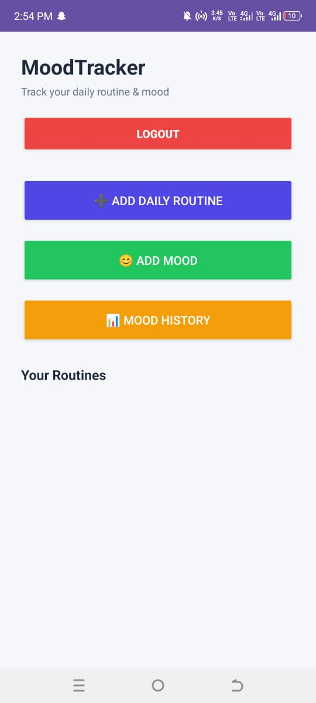
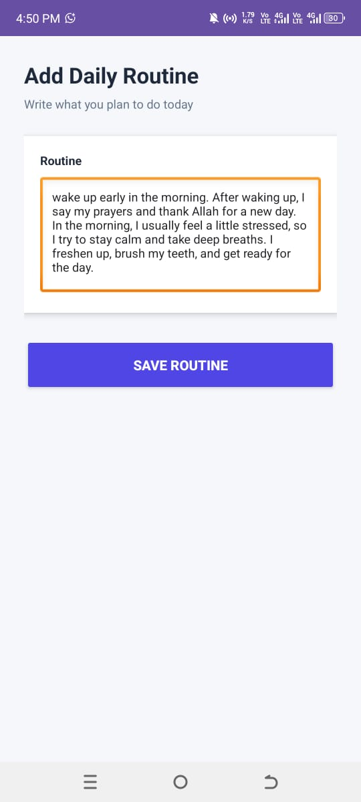
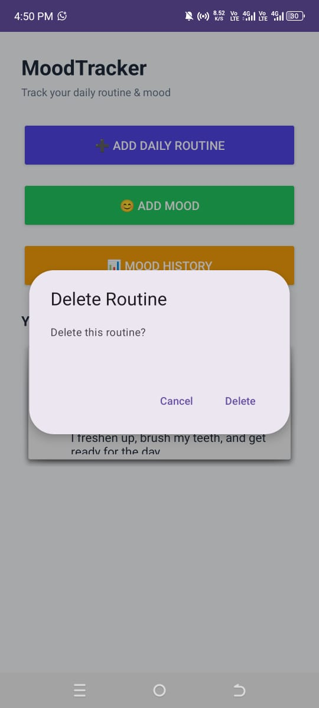
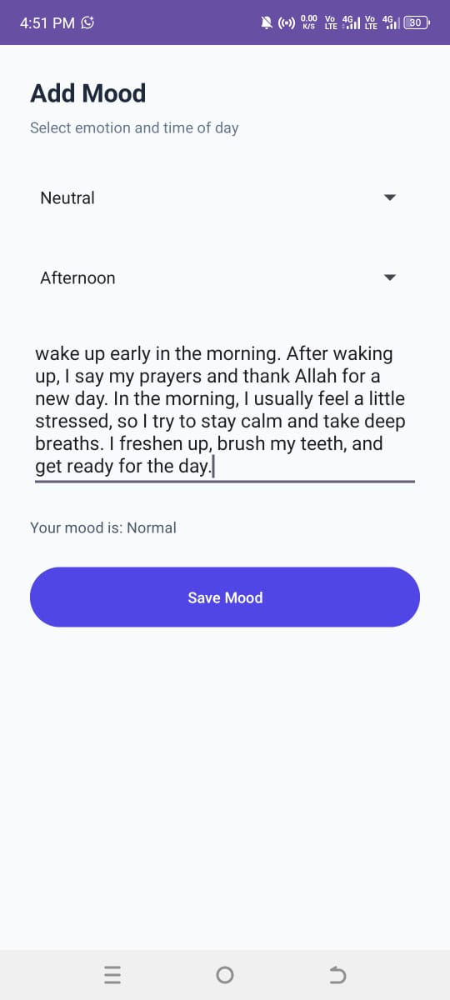
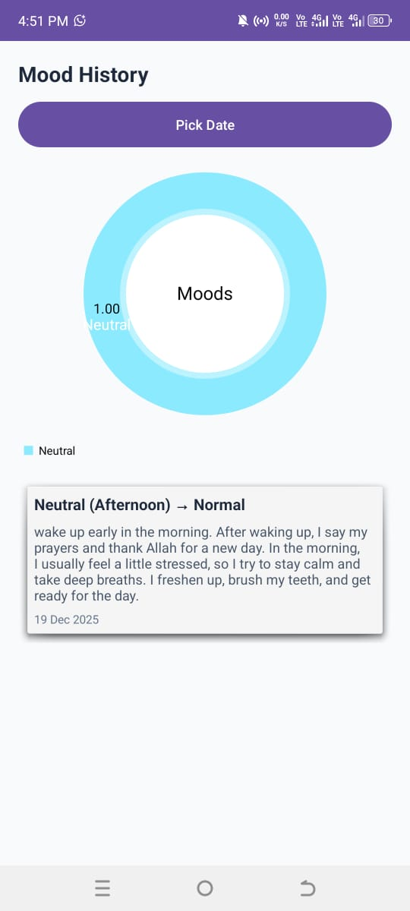
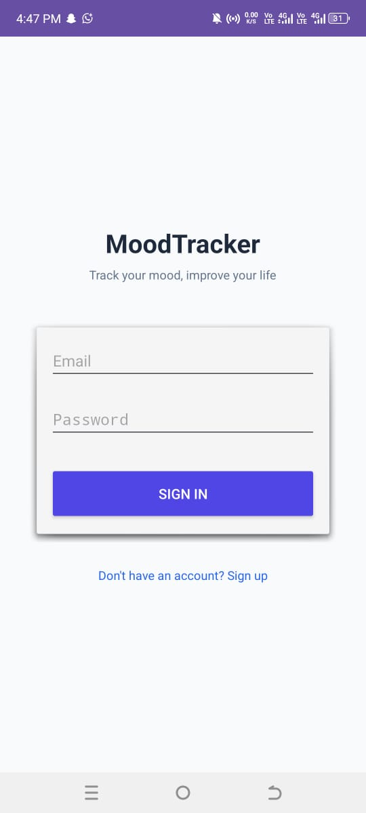
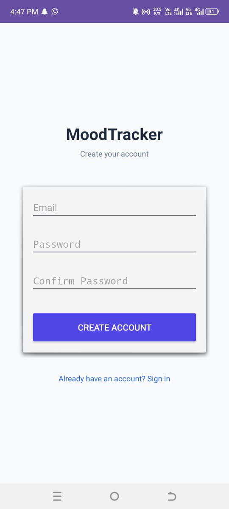

# 📱 MoodTracker – Personal Planning App

MoodTracker is a Kotlin-based Android application designed to help users manage their daily routines and track their moods effectively. The app stores data locally using Room Database and provides a clean, professional user interface following Material Design principles.

---

## ✨ Features

### 📝 Task & Routine Management
- Add and delete daily routines
- Simple and clean task list
- Long-press to delete routines

### 😊 Mood Tracking
- Record daily mood (Happy, Neutral, Sad, etc.)
- Add optional notes with mood entries
- Save mood data with date & time

### 📊 Mood History
- View mood history in a list
- Analyze mood trends over time
- Prepared for future chart integration

### 🔐 Authentication
- User registration (Sign Up)
- Secure login using Room Database
- Offline authentication support

### 💾 Offline Storage
- Uses **Room Database (SQLite)**
- No internet required
- Fast and reliable local storage

---

## 🧱 Tech Stack

- **Language:** Kotlin
- **Architecture:** MVVM (Basic)
- **Database:** Room (SQLite)
- **UI:** XML + Material Design
- **Version Control:** Git & GitHub

---

## 📸 App Screenshots

### Home Screen


### Add Routine


### Delete Routine


### Add Mood


### Mood History


### Login


### Register


---

## 🚀 How to Run the Project

1. Clone the repository:
   ```bash
   git clone https://github.com/mabubakar4321/MoodTracker-Personal-Planning.git
